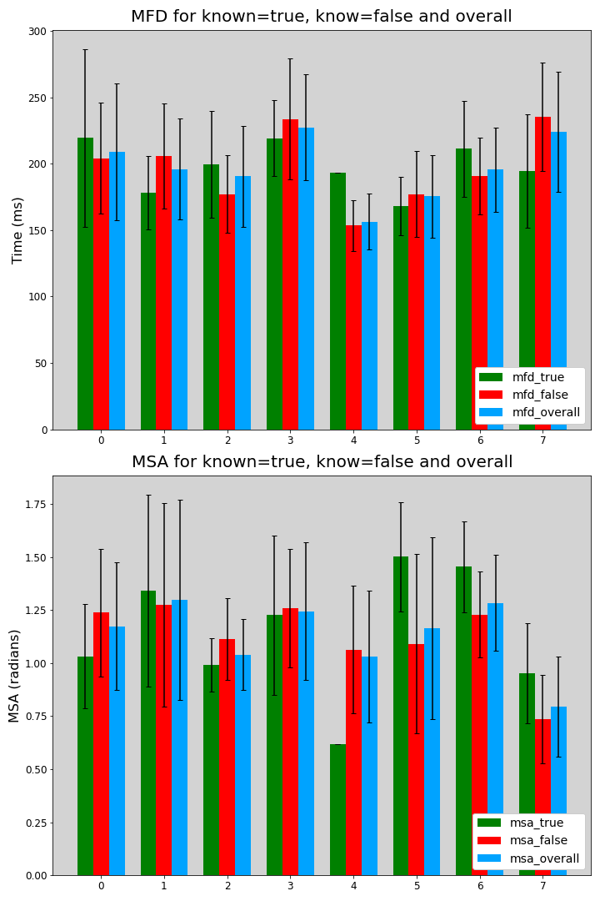

# eye tracking 2022 project

- [x] reading the dataset
- [x] Fixation detection algorithm
- [x] visualization of results
- [x] report

## Tasks

1 - Load the raw data for the subjects assigned to your group. Perform fixation detection using an algorithm of your choice (pick the one you selected in the homeworks) and the deep learning model (U'n'Eye) from the Event detection and fixation generation module. Try two distinct settings for your algorithm and compare the results between the two settings and the U'n'Eye output. Compare the differences in terms of how many fixations were detected and what were the average fixation durations. You can also come up with other ways of comparing the detection performance.

For your chosen algorithm, you will need to output the duration and centroid point of each fixation for further processing.

2 – Using your chosen fixation detection algorithm, report for your data the following analyses: for each subject, mean fixation durations (MFD) and mean saccade amplitudes (MSA) for the known=true and for known=false (four values in total). For all subjects: aggregated mean fixation duration and mean saccade amplitude (two values). Include standard deviation (SD) for all measures.

A mean fixation duration (MFD) is the sum of durations of all fixations belonging to one condition (known = true or known = false) divided by the number of fixations from this condition, e.g. all fixations that belong to one subject and to one setting (e.g. known = true, or known=false, or all data).

3 - Create a csv file with the following structure and header, named according to your group, and fill in the resulting data for all subject ids assigned to your group:

subject_id MFD_true MFD_SD_true MFD_false MFD_SD_false MSA_true MSA_SD_true MSA_false MSA_SD_false MFD_overall MFD_overall_SD MSA_overall MSA_overall_SD

... ... ... ... ... ...

... ... ... ... ... ...

4 - Create plots from the data, using SPSS, Excel, R, Matlab, matplotlib, or a tool of your choice. Use charts so that you can indicate standard deviation or standard error of the mean (SEM) as +-error bars. Important: compare the known=true and known=false conditions (for aggregated data of all your subjects), and discuss eventual differences briefly. You may add other visualizations, for example a scatter plot of MSA x MFD. The goal is to show insights into the data. Use the plots in the report (see next).

5 - Write a brief report detailing all steps for both parts of the project (including data capture in part 2). Sections to be included:

Part 1: Algorithm, Data Analysis, Plots, Discussion of results, (about 3 pages)

Part 2: Data capture description, Discussion of results, (about 1 page)

Group members and Contribution, References.

The report need to including the settings of your algorithm, pseudo code, and link to the source code of the data processing script or notebook (downloadable through the link!), not exceeding 5 pages. Include the output csv file snippet.

Use the official conference format for the ACM template: <https://www.acm.org/publications/proceedings-template> OR <https://www.overleaf.com/gallery/tagged/acm-official#.WOuOk2e1taQ> and create a pdf of the document.

Important: List the group members, and indicate their contribution out of the total 100%. Consider separately work on the homeworks and work on this project.

Create a zip file and submit it using the Assignment.

## Grading

Evaluation: Project takes a large proportion of the overall grade, so carefully draft the report. The target is an almost-like scientific-level publication, so use references and proper formatting.

Part 1 grading: Max 20 points (data analysis incl csv file, source code/algorithmic approach)

Part 2 grading: Max 10 points (analysis and discussion based on recordings)

Report: Max 10 points (Clarity and completeness of the report 0-5, Charts and visualization 0-5).

## Tips

Typical errors: missing error bars in charts or other challenges for clear understanding of the visualization, missing evaluation of group work, incorrect template (ACM is a must), missing sections, no scientific references, no or limited discussion of results.
